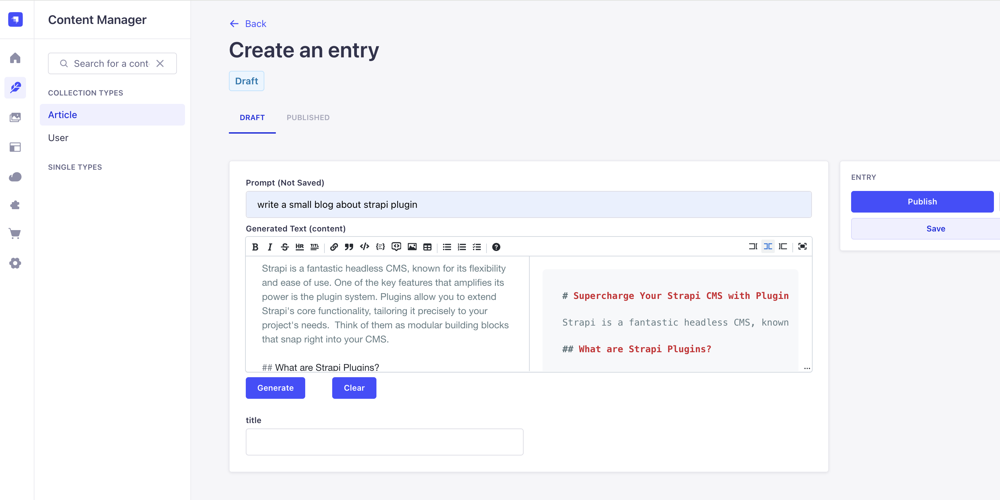
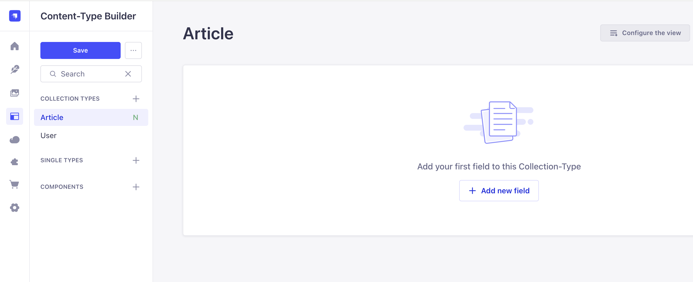
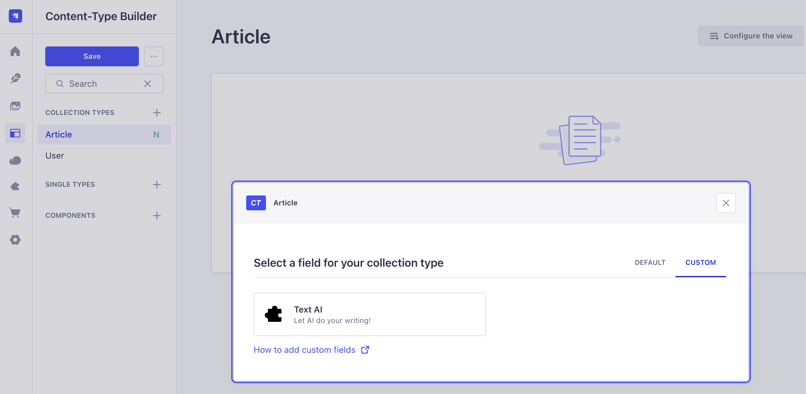
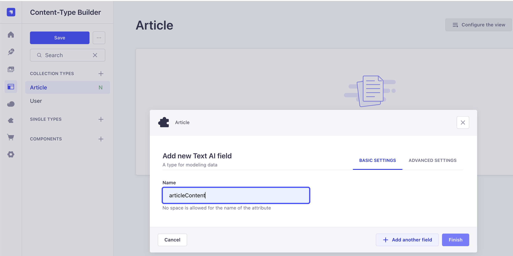
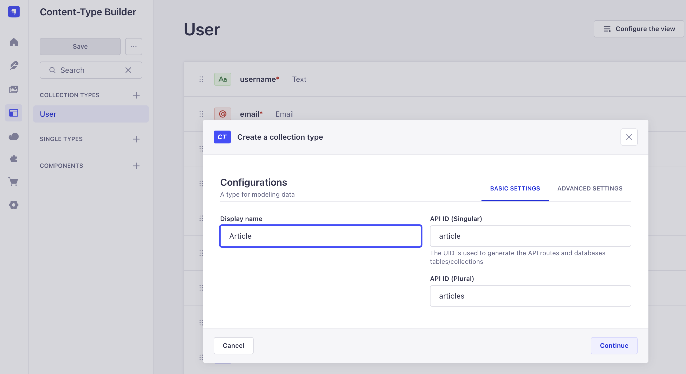
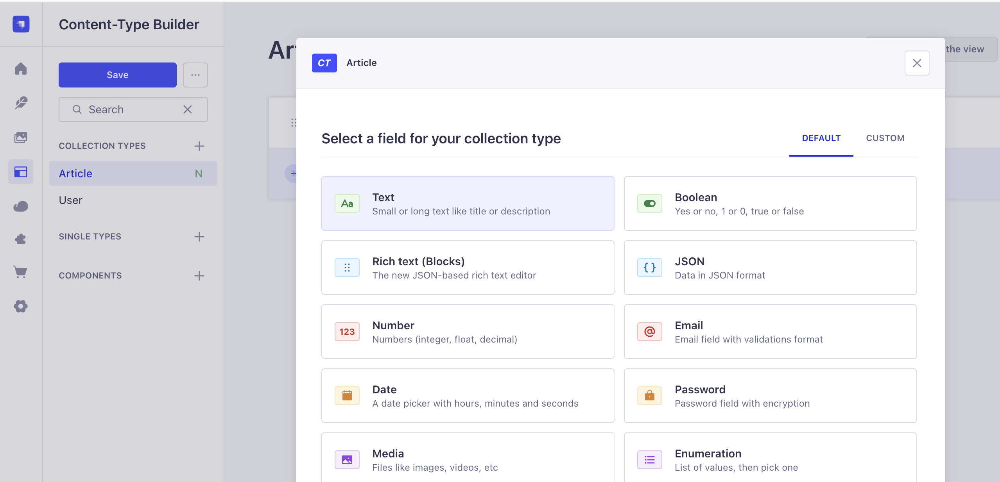
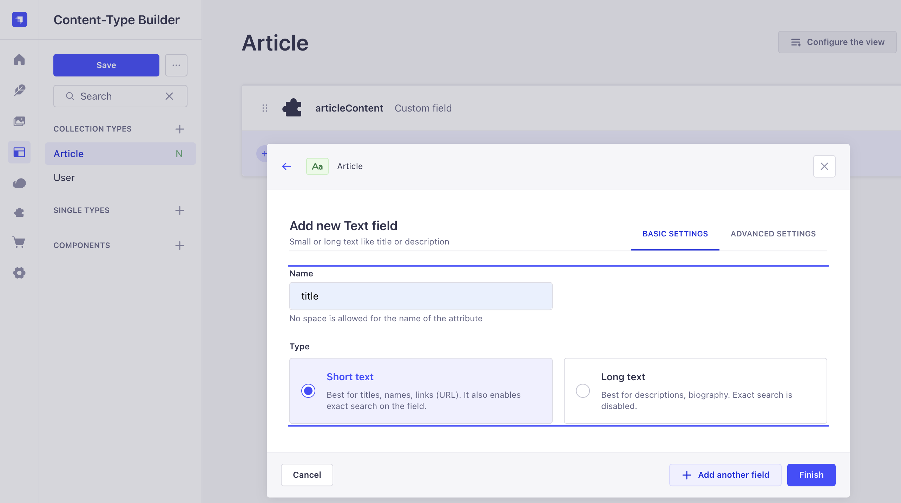
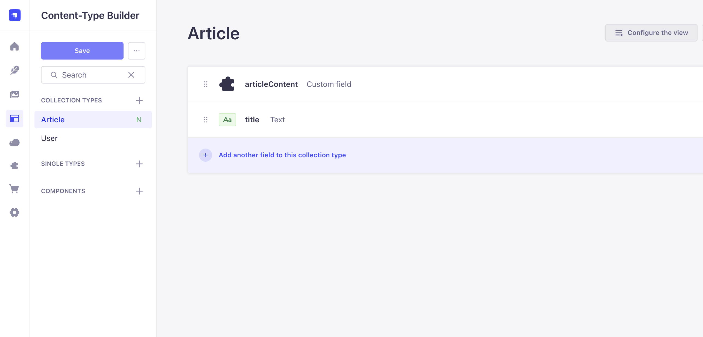
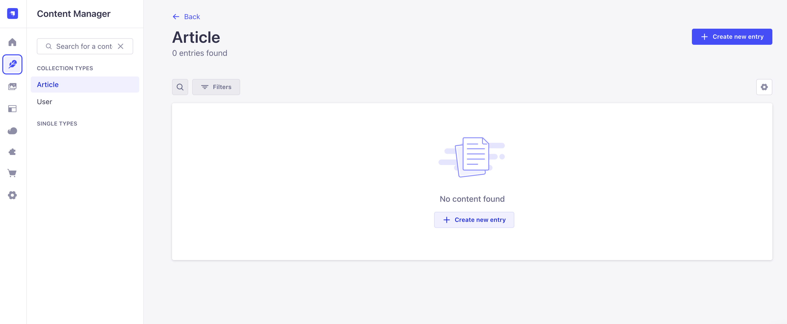

# Building the @genai/gemini-content-generator Strapi Plugin



## Introduction

The `@genai/gemini-content-generator` is a Strapi plugin designed to automate and enhance content creation using Google Gemini AI. This blog details the technical implementation, architecture, and publishing workflow of the plugin.

---

## Project Structure

The plugin follows the standard Strapi plugin architecture:

- `admin/` — React-based UI for Strapi admin panel integration
- `server/` — Node.js backend logic for Strapi plugin API and services
- `dist/` — Compiled output for publishing
- `docs/images/` — Documentation and blog images



---

## Key Features

- **Content Generation**: Uses Google Gemini AI to generate and suggest content for Strapi collections.
- **Admin UI**: Seamless integration with Strapi admin panel for easy content generation and management.
- **Configurable**: API keys and settings are managed via environment variables for security and flexibility.

---

## Implementation Details

### 1. Google Gemini AI Integration

The plugin leverages the `@google/generative-ai` npm package to interact with Gemini AI APIs. The backend service in `server/` handles API requests, authentication, and error handling.

```js
// Example: server/services/gemini.js
const { GoogleGenerativeAI } = require('@google/generative-ai');

const gemini = new GoogleGenerativeAI(process.env.GEMINI_API_KEY);

module.exports = {
  async generateContent(prompt) {
    return await gemini.generate({ prompt });
  },
};
```



### 2. Strapi Admin Panel Extension

The `admin/` directory contains React components that extend the Strapi admin UI. These components provide buttons and forms for triggering content generation and displaying results.

- Uses Strapi Design System for consistent UI
- Handles async requests to the backend service



### 3. Plugin Configuration

Configuration is managed via environment variables and Strapi's plugin settings. Sensitive data like API keys are never committed to the repo, thanks to `.env` and `.dockerignore` rules.

```env
GEMINI_API_KEY=your-google-gemini-api-key
```

---

## Publishing & CI/CD

The project includes a GitHub Actions workflow for automated publishing:

- On every push to `main`, the workflow:
  - Bumps the version
  - Tags the release
  - Publishes to npm
  - Creates a GitHub release

---
# Using the plugin

## Installation

```bash
npm install @genai-cms/gemini-content-generator
```

## Enable Plugin
Add the plugin to your `config/plugins.js` or `config/plugins.ts`:

```js
module.exports = {
    'gemeni-content-generator': {
        enabled: true
    },
};
```

## Creating a Gemini API Key

1. Visit the [Google AI Studio](https://aistudio.google.com/app/apikey) and sign in with your Google account.
2. Click on "Create API key" and follow the prompts.
3. Copy the generated API key.
4. Add the API key to your `.env` file as shown below:
    ```
    GEMINI_API_KEY=<YOUR GEMENI API KEY>
    ```

## Usage

After the plugin installation and configuration, you can access the `Text AI` field under `CUSTOM` fields tab. You can use this field to generate content for your collection types using the Google Gemini AI service. Below screenshot shows the custom `Text AI`.


For more details, refer to the plugin documentation or the Strapi marketplace page.


# Example Strapi Project
There is an example strapi projec [strapi-genai-plugin-example](https://github.com/sshindetech/strapi-genai-plugin-example). Follow the steps in the example project to see the plugin demo.

# Sample Screen
## Create new collection type


### Add fields (custom and regular) to the collection





## Create new entry in the newly created collection

## Use the custom Text AI fields to generate content (using a prompt)


---

# Conclusion

The `@genai/gemini-content-generator` plugin brings the power of Google Gemini AI to Strapi, making content creation faster and smarter. With a robust architecture, clean admin UI, and automated publishing, it's ready for production use and open-source collaboration.


---

